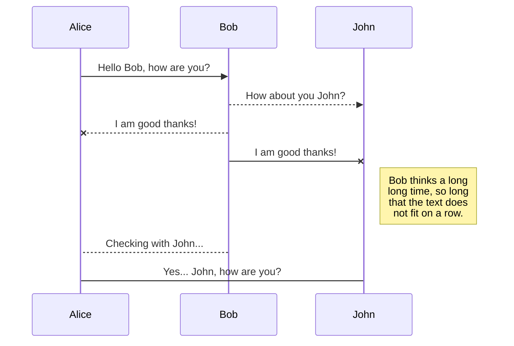
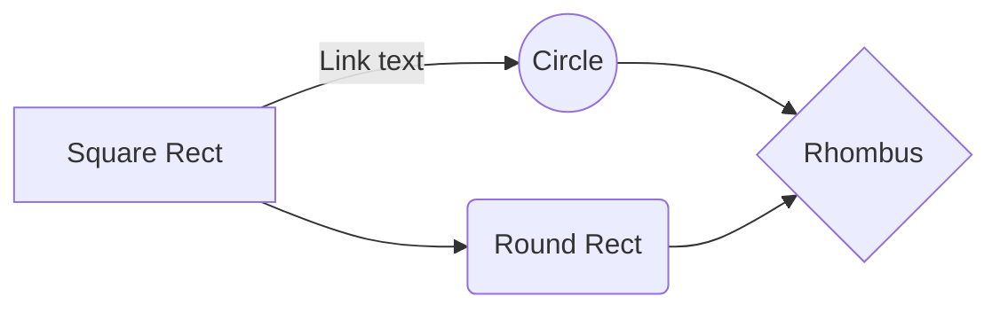

##### 996工作制是奋斗还是剥削？你该不该加班？李永乐老师讲机会成本

- 机会成本： 获得A = 放弃B

    | 鱼     |  熊掌  |
    |--------|   --- |
    | 600    |      0|
    | 500    |      1|
    | 300    |      2|
    | 0      |      0|

  - 生活案例
    - 农民 ≥ 种地 ≈ 打工
    - 学生 ≥ 考研 ≈ 工作
    - 工人 ≥ 加班 ≈ 休息 ≠ 健身 ≠ 读书 ≠ 恋爱
  - 时间成本不同
    - 富人 1h ≥ ¥10000 （ƒx ≥ 买LV包 | f0 ≤ 谈恋爱）
    - 穷人 1h ≥ ¥10 （ƒx ≥ 谈恋爱 | fx ≤ LV包）

- 成本收益
  - 编辑成本递增
  - 编辑效用递减

###### KaTeX

You can render LaTeX mathematical expressions using [KaTeX](https://khan.github.io/KaTeX/):

The *Gamma function* satisfying $\Gamma(n) = (n-1)!\quad\forall n\in\mathbb N$ is via the Euler integral

$$
\Gamma(z) = \int_0^\infty t^{z-1}e^{-t}dt\,.
$$

> You can find more information about **LaTeX** mathematical expressions [here](http://meta.math.stackexchange.com/questions/5020/mathjax-basic-tutorial-and-quick-reference).

###### UML diagrams

You can render UML diagrams using [Mermaid](https://mermaidjs.github.io/). For example, this will produce a sequence diagram:

